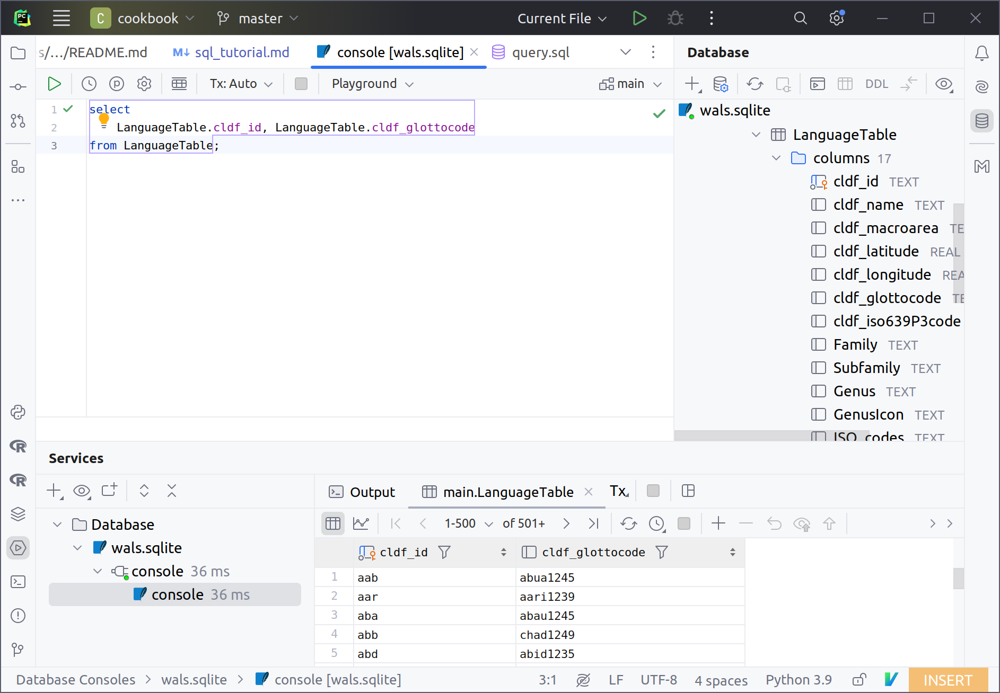

# CLDF + SQL

## SQL - the Structured Query Language

### A DSL (domain-specific language)

SQL is a domain-specific language,

> particularly useful in handling structured data, i.e., data incorporating relations among entities and variables.

It is not a general purpose language like Python, so among other things it does not support file reading, 
writing, file system operations, etc.

As DSL it is similar to [POSIX Regular Expressions](https://en.wikipedia.org/wiki/Regular_expression), and like
RegExes, SQL is well supported and integrated as data access DSL in general purpose languages like
R (via [RSQLite](https://cran.r-project.org/web/packages/RSQLite/vignettes/RSQLite.html))
and Python (via the [sqlite3 module](https://docs.python.org/3/library/sqlite3.html)).


### SQL is old

SQL was introduced in 1970. Thus, terminology like "join", "select", "group by", "intersect", "union",
which is found in many programming languages, comes from SQL!

E.g. Python's [itertools.groupby](https://docs.python.org/3/library/itertools.html#itertools.groupby)
or [dplyr's `join_*` functions](https://www.rdocumentation.org/packages/dplyr/versions/0.7.8/topics/join).

Learning SQL is a bit like learning Latin. Knowing SQL makes it somewhat easier to understand all of its derivatives.
But the only people speaking it are a bit strange :)

SQL is (still) good to have on your CV if you ever apply for data scienctist jobs. 
[Google](https://www.google.com/search?q=is+sql+needed+for+data+science)
has snippets saying "extremely important" and "absolutely necessary" on the first page of results for 
"is sql needed for data science" ...


### SQL is *declarative* (as opposed to *imperative*)

> SQL is an example of a declarative programming language. Statements do not describe computations directly, but instead describe the desired result of some computation.

One of the more visible aspects of declarative languages is the lack of "control flow statements" - no
loops, no if statements.

Since an SQL program does not list operations in order of execution, modularization does not work via
functions that encapsulate procedural operations, but rather in aliasing parts of a result.

Example:

To obtain a list of all languages without Glottocode in a CLDF dataset, we could run the following
imperative Python code:
```python
languages = []
for language in cldf.objects('LanguageTable'):
    if language.cldf.glottocode is None:
        languages.append(language)
```
which is roughly equivalent to the following SQL run on a SQLite database loaded with the CLDF dataset:
```sql
SELECT * FROM LanguageTable WHERE cldf_glottocode IS NULL;
```

While the "lack of expressiveness" (it's harder to create complex SQL code, because you cannot simply string together instructions) 
might seem like a disadvantage, it actually is advantageous to judge applicability of SQL: 
If you can fit your data aggregation needs into one statement (one *query*) (and possibly a handful of
*CTEs*), SQL could be a good choice.


### SQL is (possibly too) big

SQL consists of multiple "sublanguages". It cannot only be used to retrieve data, but also to create and
manipulate the data schema (i.e. create and manipulate tables, indexes, etc.).

SQL also includes a sublanguage to manipulate data, i.e. `INSERT`, `UPDATE` and `DELETE` data. And since
most SQL database management systems allow access to the data by multiple clients simultaneously, there
also needs to be support for "transactions" - i.e. a way to specify a set of SQL queries that must be guaranteed
to operate on a consistent state of the database, undisturbed by modifications by other clients.

In the context of CLDF datasets we are only interested in "Data Query Language" part of SQL, and treat
databases basically as read-only data stores.


### SQL is - unfortunately - somewhat diverse

The size of the SQL standard is probably one of the reasons that SQL implementations - i.e. relational
database management systems (RDBMSs) - are often a bit idiosyncratic.

> Despite the existence of standards, virtually no implementations in existence adhere to it fully, and most SQL code requires at least some changes before being ported to different database systems.

While we might expect that the more complex or cryptic parts of the standard contribute more to this
idiosyncracy, there are also quite commonly used functionalities which behave differently across implementations.
E.g. common functions may have (very) different names (cf. [PostgreSQL `string_agg`](https://www.postgresql.org/docs/9.0/functions-aggregate.html) vs 
[SQLite's [`group_concat`](https://www.sqlite.org/lang_aggfunc.html#group_concat)) and implementations may support different
sets of atomic column data types.

But this diversity/idiosyncrasy is alleviated by SQL being very well supported in IDEs like PyCharm (professional). 
You can associate a project with a database and get a query console to write SQL with tab-completion for table and column names, function names, etc.




### SQLite

But a major reason why SQL is a good choice for data manipulation in linguistics (or in research data analysis in general) is 
SQLite, an ubiquitous, [database engine](https://en.wikipedia.org/wiki/Database_engine) that works on 
**single-file** databases. So SQL's diversity only hurts us by making googling for SQL solutions a bit trickier. (But it's good to know 
that should we run into performance issues with SQLite, PostgreSQL is a likely solution - and is known for adhering "most"
to the SQL standard.)

SQLite is an embedded SQL database engine (embedded in the code accessing the database) as opposed to
RDBMSs like PostgreSQL or MySQL, where the database engine runs in a server-like process and is accessed
over the network (or sockets) by clients. Being embeddable means SQLite is everywhere! Firefox stores its bookmarks in SQLite:

```sql
sqlite> select visit_count, url from moz_places where url like '%ufggym%' order by visit_count desc limit 3;
116|https://ufggym.eltern-portal.org/start
116|https://ufggym.eltern-portal.org/aktuelles/elternbriefe
81|https://ufggym.eltern-portal.org/aktuelles/schwarzes_brett
```

Shotwell stores its collection metadata in SQLite
```shell
$ sqlite3 .local/share/shotwell/data/photo.db
SQLite version 3.31.1 2020-01-27 19:55:54
Enter ".help" for usage hints.
sqlite> select count(*) from PhotoTable;
44111
```

SQLite also adds functionality like input and output on top of running SQL queries.

[Importing CSV](https://www.sqlitetutorial.net/sqlite-import-csv/):

```sql
sqlite> .mode csv
sqlite> .import wals/cldf/languages.csv wals_langs
sqlite> .schema
CREATE TABLE IF NOT EXISTS "wals_langs"(
  "ID" TEXT,
  "Name" TEXT,
  "Macroarea" TEXT,
  "Latitude" TEXT,
  "Longitude" TEXT,
  "Glottocode" TEXT,
  "ISO639P3code" TEXT,
  "Family" TEXT,
  "Subfamily" TEXT,
  "Genus" TEXT,
  "GenusIcon" TEXT,
  "ISO_codes" TEXT,
  "Samples_100" TEXT,
  "Samples_200" TEXT,
  "Country_ID" TEXT,
  "Source" TEXT,
  "Parent_ID" TEXT
);
```

> ![NOTE]
> Tools like the `csvsql` command from the `csvkit` package exploit these functionalities of sqlite:

```shell
$ csvsql wals/cldf/languages.csv --query "SELECT count(*) FROM languages WHERE Latitude > 0"
count(*)
1724
```

[Exporting query results to CSV](https://www.sqlitetutorial.net/sqlite-export-csv/)

```sql
sqlite> .mode csv
sqlite> .import ../../wals/wals/cldf/languages.csv wals_langs
sqlite> .headers on
sqlite> .output langs.csv
sqlite> SELECT * FROM wals_langs;
sqlite> .quit
```

If you want more control over the CSV format - like changing delimiters or quoting behaviour - you should
access the data using the an SQLite connection from your preferred programming language, though.

Last but not least, the SQLite database format is also among the ["preferred" formats of the Library of Congress](https://www.loc.gov/preservation/resources/rfs/data.html)
for the archiving of datasets (together with CSV, JSON, and a couple more)

> [maximizing the chances for survival and continued accessibility of creative content well into the future.](https://www.sqlite.org/locrsf.html)

> ![WARNING]
> While SQLite is ubiquitous, not each SQLite engine you encounter will have the same capabilities.
> There are a lot of extensions for SQLite - e.g. for [mathematical functions](https://www.sqlite.org/draft/lang_mathfunc.html)
> but whether they are available in a particular SQLite engine depends on whether that engine has been compiled
> with support for it - i.e. cannot be changed at runtime. For example the SQLite engine shipped with Python does
> not have a `stdev` function. (But we will see below, how this can be remedied.)


## CLDF SQL

Why is SQL(ite) useful when dealing with CLDF data?

Each CLDF dataset can be converted to a SQLite database, running the `cldf createdb` command installed
with `pycldf`. This SQLite database makes uniform access a lot easier for tools that are not CLDF aware:
- tables are named with component names rather than filenames, so data about languages will be stored
  in a table called `LanguageTable`, no matter what the file in the CLDF dataset was called (e.g. 
  [`societies.csv` in the case of D-PLACE datasets](https://github.com/D-PLACE/dplace-dataset-ea/tree/main/cldf))
- columns are named with CLDF property terms rather than - possibly custom - column names. Thus, the column
  holding Glottocodes will always be called `cldf_glottocode`
- foreign keys are inferred from CLDF reference properties

We can create a SQLite database loaded with version v2020.3 of WALS running
```shell
cldf createdb https://raw.githubusercontent.com/cldf-datasets/wals/v2020.3/cldf/StructureDataset-metadata.json wals.sqlite
```


## SQL - Getting started

The software carpentry lesson [Databases and SQL](https://swcarpentry.github.io/sql-novice-survey/)
provides a really good introduction to both, SQL and SQLite.

To recapitulate the main points of this intro, we can inspect the
following query which computes the number of datapoints in WALS for each Glottocode assigned to a
WALS language in the [Central Pama-Nyungan genus](https://wals.info/languoid/genus/centralpamanyungan).
Note that we exploit the fact that values are linked to languages by the required 
[languageReference](https://github.com/cldf/cldf/blob/d529ef48e99ab6a36d43f8734809190d54ea2a4a/components/values/ValueTable-metadata.json#L15-L21)
in `ValueTable`.

```sql
-- 1. Selecting data
SELECT coalesce(l.cldf_glottocode, '########') AS Glottocode,  -- 5. Missing data + 4. Calculating new values
       group_concat(distinct l.cldf_name) AS Names,  -- 2. ... removing duplicates
       count(v.cldf_id) AS Datapoints  -- 6. Aggregation
FROM LanguageTable AS l
         JOIN  -- 7. Combining data
     ValueTable AS v
     ON l.cldf_id = v.cldf_languageReference
WHERE l.Genus = 'Central Pama-Nyungan'  -- 3. Filtering
GROUP BY l.cldf_glottocode  -- 6. Aggregation
ORDER BY Datapoints DESC;  -- 2. Sorting ...
```

> [!NOTE]
> Except for the `WHERE l.Genus = ...` clause, this query will work on basically every CLDF StructureDataset.

The result of the query shows that one language has no Glottocode, represented by the special `NULL`
value, which we turned into `'######'` via the [`coalesce` function](https://www.sqlitetutorial.net/sqlite-functions/sqlite-coalesce/).

Glottocode|Names|Datapoints
--- | --- | ---
east2379|Arrernte (Mparntwe)|79
dier1241|Diyari|73
alya1239|Alyawarra|52
pitt1247|Pitta Pitta|41
darl1243|Paakantyi|41
arab1267|Arabana|36
yand1253|Innamincka|26
west2441|Arrernte (Western)|22
ngur1261|Wangkumara|16
adny1235|Adynyamathanha|15
wira1265|Wirangu|12
kaur1267|Kaurna|3
bang1339|Banggarla|3
########|Arrernte|2
wang1290|Wangkangurru|1
kayt1238|Kaytej|1


### Running SQL queries

With [sqlite3](https://sqlite.org/cli.html):

- interactively:
  ```sql
  $ sqlite 
  SQLite version 3.37.2 2022-01-06 13:25:41
  Enter ".help" for usage hints.
  sqlite> select cldf_id, cldf_name from languagetable limit 5;
  aab|Arapesh (Abu)
  aar|Aari
  aba|Abau
  abb|Arabic (Chadian)
  abd|Abidji
  ```
- from the shell:
  ```shell
  $ sqlite3 wals.sqlite "select cldf_id, cldf_name from languagetable limit 5;"
  aab|Arapesh (Abu)
  aar|Aari
  aba|Abau
  abb|Arabic (Chadian)
  abd|Abidji
  ```
- or save SQL in a text file and feed it into `sqlite3` via [input redirection](https://www.gnu.org/software/bash/manual/html_node/Redirections.html#Redirecting-Input):
  ```shell
  $ sqlite3 wals.sqlite < q.sql 
  aab|Arapesh (Abu)
  aar|Aari
  aba|Abau
  abb|Arabic (Chadian)
  abd|Abidji
  ```

Controlling the output formatting:
```shell
$ sqlite3 --header --csv lsi.sqlite "select cldf_id, cldf_name from languagetable limit 5"
cldf_id,cldf_name
JAPANESE,JAPANESE
AINU,AINU
KOREAN,KOREAN
TURKI,TURKI
MANCHU,MANCHU
```


Getting used to SQL as R user: Maybe start with dbplyr https://dbplyr.tidyverse.org/ - running
[show_query](https://dplyr.tidyverse.org/reference/explain.html) now and then.


## SQLite advanced

SQLite offers some advanced features which make it particularly suited for our use cases. We'll look
at these using a "real-world" example: We will compare phoneme inventories for Malayalam,
- as described in the PHOIBLE database vs.
- as extracted from the lexical data in the Linguistic Survey of India.

Of course, comparability of phonemes across datasets is mediated by CLTS, so we'll need the following
three datasets:
- PHOIBLE
- LSI
- CLTS

All three are available as CLDF datasets, and running `cldf createdb` we can load all three in individual
SQLite databases:
```shell
cldf createdb 
```


### ATTACH DATABASE

SQLite allows *attaching* multiple databases to the **same** connection - and querying across these
databases seamlessly!

E.g. we can easily compare coverage across datasets:
```sql
sqlite> attach database "lsi.sqlite" as lsi;
sqlite> attach database "phoible.sqlite" as phoible;
sqlite> select l.cldf_glottocode, l.cldf_name, p.cldf_name
   ...> from lsi.languagetable as l join phoible.languagetable as p on l.cldf_glottocode = p.cldf_glottocode
   ...> where l.cldf_glottocode like 'mala%';
mala1464|MALAYALAM|Malayalam
```


### CTEs (aka "inline VIEWs")

A good way to make SQL more modular, by using "named subqueries".

> common table expressions (CTE) are temporary result sets defined within the scope of a query.
https://www.sqlitetutorial.net/sqlite-cte/

```sql
select count(*) from formtable 
where cldf_id not in (
    select cldf_formReference from cognatetable);
```
vs.
```sql
with has_cognate as (select cldf_formReference from cognatetable) 
select count(*) from formtable where cldf_id not in has_cognate;
```


### WITH RECURSIVE

https://til.simonwillison.net/sqlite/simple-recursive-cte

Example: Split Glottolog classification into individual rows
https://github.com/glottolog/glottolog-cldf/blob/1eae737024e03d9e32b3b50571ea9997537344ab/cldf/parameters.csv#L4
```sql
with ancestors(ancestor, classification, level) as (
    select 
        '' as ancestor, 
        v.cldf_value as classification,
        0 as level
    from valuetable as v
    where
        v.cldf_languageReference = 'mala1464' and
        v.cldf_parameterReference = 'classification'
    union all
    select
        substr(classification, 0, 9),
        substr(classification, 10),
        level + 1
    from ancestors
    where classification != ''
)
select printf('%.*c', level, ' ') || '|- ' || ancestor from ancestors where ancestor != '' order by level;
```

prints
```shell
$ sqlite3 glottolog.sqlite < q.sql 
 |- drav1251
  |- sout3133
   |- sout3138
    |- tami1291
     |- tami1292
      |- tami1293
       |- tami1294
        |- tami1297
         |- tami1298
          |- mala1541
```


### Window functions: OVER

https://www.sqlite.org/windowfunctions.html

> A window function is an SQL function where the input values are taken from a "window" of one or more rows in the results set of a SELECT statement.

https://www.sqlitetutorial.net/sqlite-window-functions/

> An SQLite window function performs a calculation on a set of rows that are related to the current row. Unlike an aggregate function, a window function does not cause rows to become grouped into a single result row. a window function retains the row identities. Behind the scenes, window functions can access more than just the current row of the query result.

In the follwing example from doreco, we use the `row_number` window function to augment the list of phones
for a word with an index number, and then only select the first ones to get "word initial phones":

https://github.com/cldf-datasets/doreco/blob/8124db8c45f1186e998d7536401dc6d6dceebb32/etc/views.sql#L3-L12


### User-defined functions with Python

https://docs.python.org/3/library/sqlite3.html#sqlite3.Connection.create_aggregate

Example:

https://github.com/cldf-datasets/doreco/blob/8124db8c45f1186e998d7536401dc6d6dceebb32/dorecocommands/query.py#L20-L43
https://github.com/cldf-datasets/doreco/blob/8124db8c45f1186e998d7536401dc6d6dceebb32/dorecocommands/query.py#L65


### A "real world" example

```sql
ATTACH DATABASE "phoible.sqlite" AS phoible;
ATTACH DATABASE "clts.sqlite" AS clts;
ATTACH DATABASE "lsi-cldf/lsi.sqlite" AS lsi;

WITH
  lsigraphemes AS (
    SELECT
      '' AS grapheme,
      'LSI' AS source,
      f.cldf_segments || ' ' AS segments
    FROM lsi.formtable AS f, lsi.languagetable AS l
    WHERE f.cldf_languagereference = l.cldf_id AND l.cldf_glottocode = 'mala1464'
    UNION ALL
    SELECT
      substr(segments, 0, instr(segments, ' ')),
      'LSI',
      substr(segments, instr(segments, ' ') + 1)
    FROM lsigraphemes
    WHERE segments != ''
  ),
  phoiblegraphemes AS (
    SELECT DISTINCT c.cltsgrapheme AS grapheme, 'PHOIBLE' AS source
    FROM
      (
        select v.cldf_value as grapheme from phoible.valuetable as v
        where cldf_languagereference = 'mala1464' and contribution_id = 1762
      ) as p
    join
      (
        select phoible.grapheme as phoiblegrapheme, clts.grapheme as cltsgrapheme 
        from clts."data/graphemes.tsv" as phoible, clts."data/sounds.tsv" as clts 
        where phoible.dataset = 'phoible' and phoible.name = clts.name
      ) as c
    on c.phoiblegrapheme = p.grapheme
  )
select g.grapheme, source, clts.name 
from (
  select distinct grapheme, source from lsigraphemes 
  where grapheme != '' and grapheme not in (select grapheme from phoiblegraphemes)
  union
  select grapheme, source from phoiblegraphemes 
  where grapheme not in (select grapheme from lsigraphemes)
) as g
join clts."data/sounds.tsv" as clts
on clts.grapheme = g.grapheme
where clts.name like '%vowel' 
order by g.source, g.grapheme;
```

- operators, 
  - like SQLite's string concatenation `||`
  - comparison with `like`
- functions like `substr`, `instr`


### JSON

-> Language Atlas example


## SQL as ideal intermediate data aggregation step between raw data and analysis (e.g. in R)

- CLDF SQL helps with re-use (of code, etc.) because it focuses on the commonalitites between CLDF datasets
- DoReCo: SQLite is fast! https://github.com/FredericBlum/initial_lengthening/blob/main/init_query.sql

  When the result is supposed to be a single table to be fed into R, SQL makes for a transparent aggregation.
