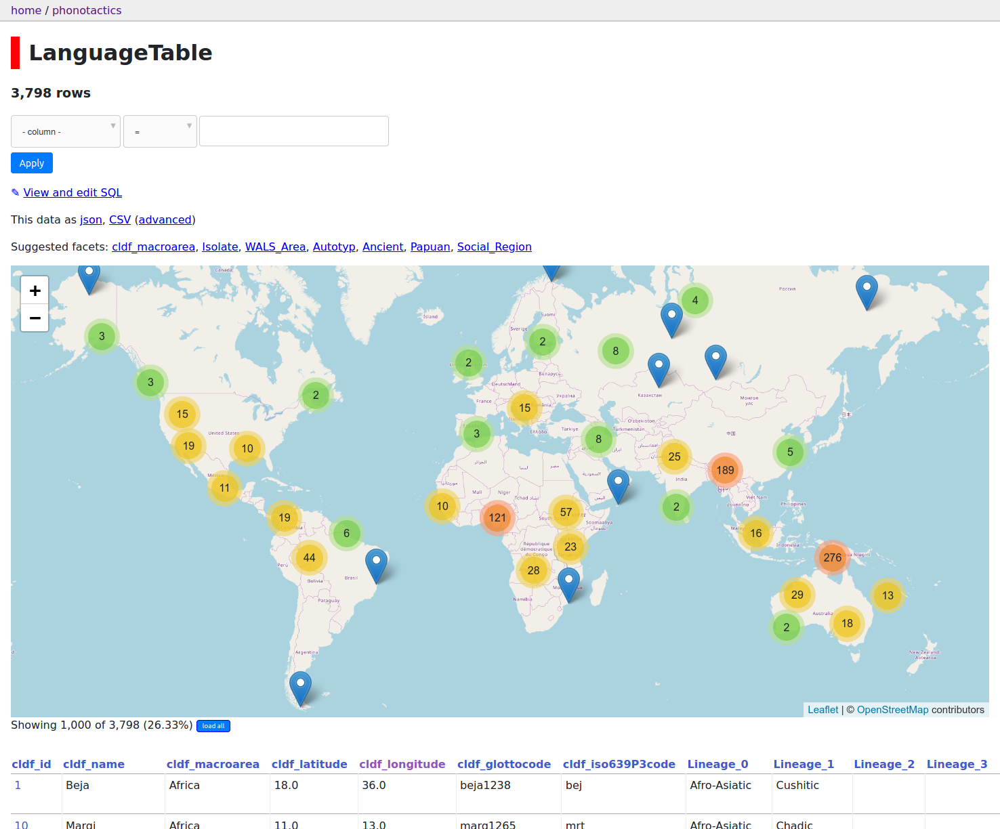

# Using *datasette* to browse a CLDF dataset

The `cldf` command, which can be installed with the Python package 
[`pycldf`](https://pypi.org/project/pycldf/) provides functionality to load
any CLDF dataset into a [SQLite](https://sqlite.org/index.html) database.
[datasette](https://datasette.readthedocs.io/en/stable/) is a powerful tool for exploring
data in SQLite database.

Thus, exploring CLDF with *datasette* is as simple as running

```shell script
pip install pycldf
pip install datasette
cldf createdb PATH/TO/CLDF/metadata.json PATH/TO/dataset.sqlite
datasette PATH/TO/dataset.sqlite
```

and visiting http://localhost:8001 in your browser.

But *datasette* provides a full-featured plugin system, which allows adding 
custom visualisations for the data. This can be paired with CLDF's metadata to
extend the usability of *datasette*. Geographic coordinates for languages - for
example - are well specified in CLDF, thus can generically be made available for
*datasette*'s [cluster map](https://github.com/simonw/datasette-cluster-map) plugin:

1. Install the plugin:
   ```shell script
   pip install datasette-cluster-map
   ```
2. Write a *datasette* configuration file, with the following content:
   ```json
   {
       "title": "",
       "plugins": {
           "datasette-cluster-map": {
               "latitude_column": "cldf_latitude",
               "longitude_column": "cldf_longitude"
           }
       }
   }
   ```
   This will make sure the appropriate columns in the SQLite database are detected.
3. Run *datasette* with the configuration:
   ```shell script
   datasette PATH/TO/dataset.sqlite -m PATH/TO/datasette_metadata.json
   ```

Navigating to the `LanguageTable` of the database in *datasette*'s interface will show
a map with clusters of language locations.


## Example: The World Phonotactics Database

Exploration tools like *datasette* are particularly important for big datasets
such as
[The World Phonotactics Database](https://doi.org/10.5281/zenodo.3613570).

Here is a screenshot of the map visualization of the `LanguageTable`:

