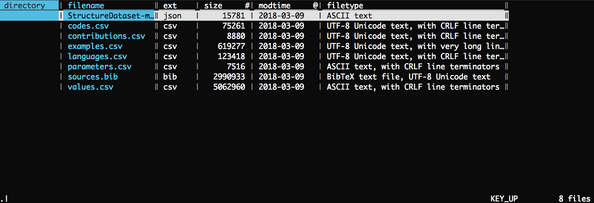
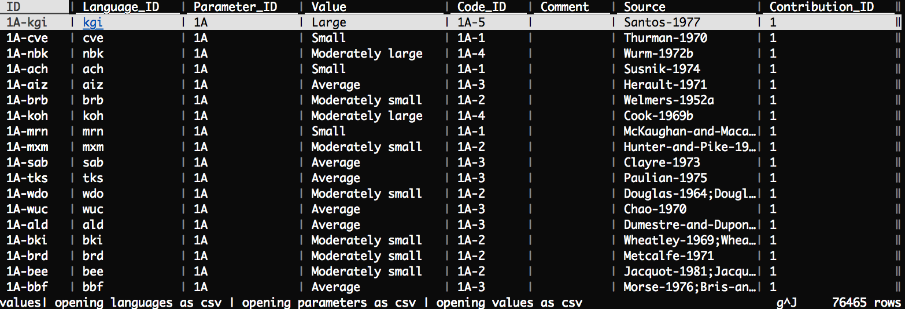
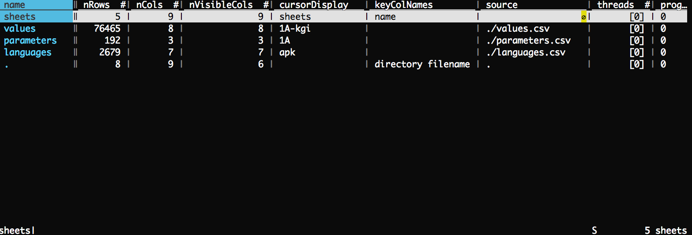
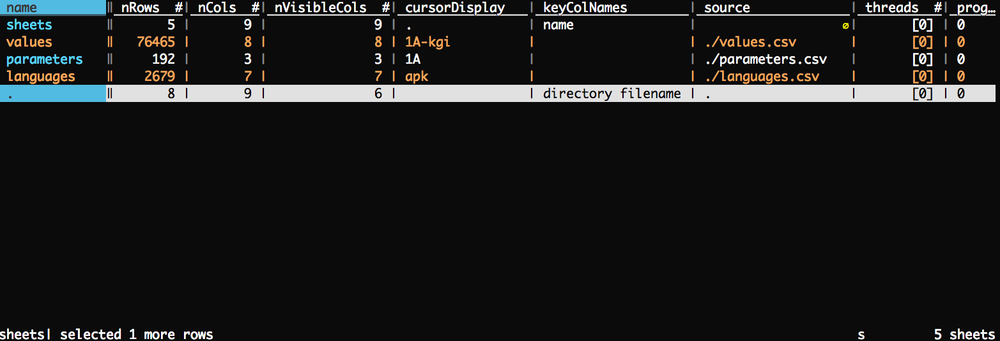
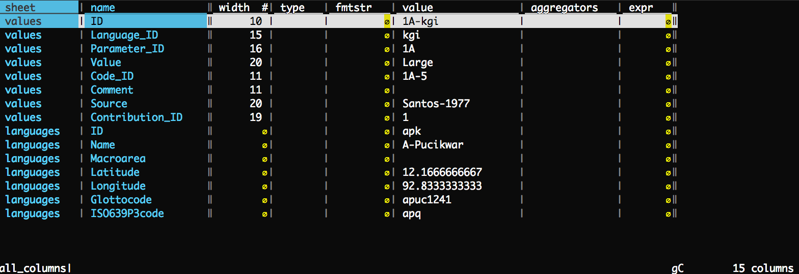
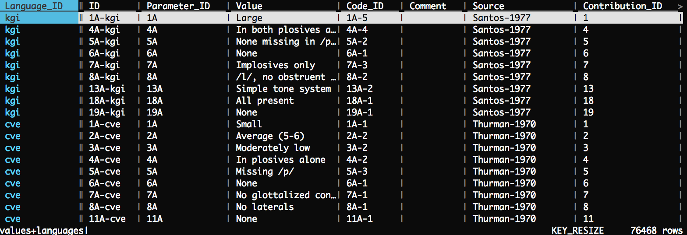

# Preparations

Download and install visidata (TODO links etc.). Download WALS CLDF
data set from here (TODO link etc.).

Download a current WALS CLDF dump:

```
wget https://cdstar.shh.mpg.de/bitstreams/EAEA0-7269-77E5-3E10-0/wals_dataset.cldf.zip
```

Unzip:

```
unzip wals_dataset.cldf.zip -d wals_cldf
```

Enter the WALS CLDF directory and get an overview over
the files that are available:

```
cd wals_cldf/ && vd
```



## visidata and WALS CLDF

`s`elect the files that you want to load. We're going to play around with
languages.csv, values.csv, and paramters.csv.


Type `g<RETURN>` to load the files that have been selected.



Use `SHIFT+S` to get an overview over the files that have been loaded:



First, let's merge values.csv and languages.csv. To do that, `s`elect the two
files in the sheet overview.



Type `gC` to get an overview over all the columns that are available for merging
in the files/sheets that have been selected.



Select the columns that should be used to perform a JOIN operation. For simplicity's
sake, let's go with Language_ID from values.csv and ID from languages.csv. Move
the selection to the respective columns and type `g!` to select a column for merging.


(note the blue highlighting for the columns that have been selected)

Return to the sheet overview with `SHIFT+S`, `s`elect the respective sheets
and input `&` to get presented with the JOIN types that are available
(inner/outer/full/diff/append). Let's perform a union operation, i.e. type `full`.



Note the values+languages at the bottom, indicating that the files have been
merged.
